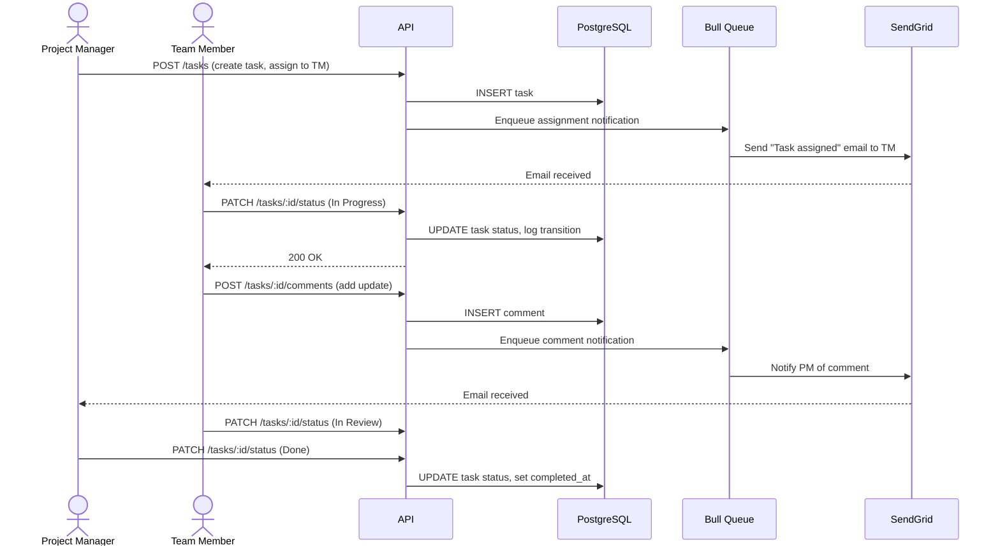
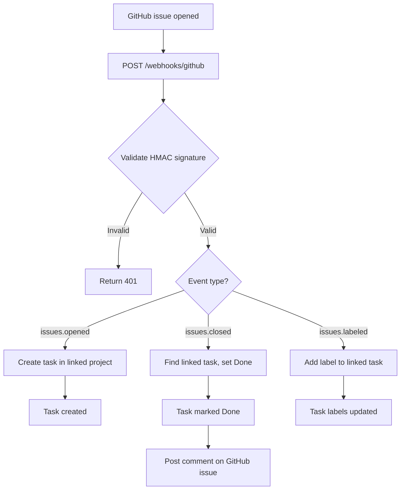

# Product Requirements Document: TaskFlow API

**Version**: 1.0 (reverse-engineered)
**Date**: 2026-01-15
**Source**: github.com/example/taskflow-api
**Status**: Draft — reviewed and approved by product team

---

## Product Overview

TaskFlow API is a RESTful backend service that powers collaborative task management for small-to-medium engineering teams. It allows team members to create, assign, and track tasks organized into projects, and notifies stakeholders of status changes via email and webhook. The system integrates with GitHub to automatically create tasks from issue events.

---

## User Personas

### Persona 1: Team Member
- **Description**: Individual contributor who creates, updates, and completes tasks assigned to them
- **Primary actions**: View assigned tasks, update task status, add comments, attach files
- **Entry points**: REST API (consumed by web frontend), CLI client
- **Evidence**: `src/routes/tasks.ts` (GET/PUT /tasks/:id endpoints filtered by assignee), `tests/e2e/task-lifecycle.test.ts`
- **Confidence**: [Verified]

### Persona 2: Project Manager
- **Description**: Team lead who creates projects, assigns tasks to team members, and monitors progress
- **Primary actions**: Create projects, create and bulk-assign tasks, view project dashboards, export reports
- **Entry points**: REST API with `role: manager` JWT claim
- **Evidence**: `src/middleware/auth.ts:34` (role check), `src/routes/projects.ts`, `tests/integration/project-management.test.ts`
- **Confidence**: [Verified]

### Persona 3: System Integrator
- **Description**: Automated system (GitHub Actions, CI pipelines) that interacts via API key
- **Primary actions**: Create tasks from external events, query task status, trigger status transitions
- **Entry points**: REST API with API key authentication
- **Evidence**: `src/middleware/auth.ts:67` (API key path), `src/routes/webhooks.ts`
- **Confidence**: [Verified]

---

## Functional Requirements

### Project Management

REQ-001: Team members can create a new project with a name, description, and optional due date.

**User story**: As a project manager, I can create a project so that I can organize related tasks under a shared context.

**Description**: Projects are the top-level organizational unit. Each project has a name (required, max 200 chars), optional description, and optional due date. The creating user becomes the project owner.

**Confidence**: [Verified]

**Evidence**:
- `src/routes/projects.ts:23` — POST /projects handler
- `src/models/project.ts:12` — Project schema with constraints
- `tests/integration/projects/create.test.ts` — Creation and validation tests

---

REQ-002: Project managers can invite team members to a project by email address.

**User story**: As a project manager, I can invite team members so that they can access and contribute to the project.

**Description**: Sends an invitation email with a time-limited token (24-hour TTL). Invited users must have an existing account. Invitations to non-existent emails are silently ignored (no enumeration).

**Confidence**: [Verified]

**Evidence**:
- `src/routes/projects.ts:78` — POST /projects/:id/invitations handler
- `src/services/invitation.ts` — Token generation and email dispatch
- `tests/integration/projects/invitations.test.ts`

---

REQ-003: Projects have a configurable status (Active, On Hold, Archived).

**User story**: As a project manager, I can change project status so that my team knows whether the project is actively receiving new work.

**Description**: Status transitions: Active -> On Hold, Active -> Archived, On Hold -> Active. Archived projects are read-only — no new tasks or comments can be added. Tasks within archived projects retain their last status.

**Confidence**: [Verified]

**Evidence**:
- `src/routes/projects.ts:112` — PATCH /projects/:id handler
- `src/services/project.ts:45` — State machine with transition guards
- `tests/unit/project-state-machine.test.ts`

---

### Task Management

REQ-004: Team members can create tasks within a project.

**User story**: As a team member, I can create a task so that work is tracked and visible to the team.

**Description**: Tasks require a title (max 500 chars) and belong to a project. Optional fields: description (markdown), assignee (one user), due date, priority (Low/Medium/High/Critical), labels (array of strings, max 10).

**Confidence**: [Verified]

**Evidence**:
- `src/routes/tasks.ts:15` — POST /tasks handler
- `src/models/task.ts` — Schema with validations
- `tests/integration/tasks/create.test.ts`

---

REQ-005: Tasks progress through a configurable status workflow.

**User story**: As a team member, I can move a task through its lifecycle so that the team knows where work stands.

**Description**: Default workflow: Todo -> In Progress -> In Review -> Done. Blocked is a parallel state reachable from any active status. Transitions are logged with timestamp and acting user. Done tasks cannot be reopened without project manager role.

**Confidence**: [Verified]

**Evidence**:
- `src/services/task-workflow.ts` — State machine implementation
- `src/routes/tasks.ts:89` — PATCH /tasks/:id/status handler
- `tests/unit/task-workflow.test.ts` — Transition coverage including blocked state

---

REQ-006: Task assignees receive email notifications when a task is assigned or its status changes.

**User story**: As a team member, I can receive notifications so that I am aware of actions that require my attention.

**Description**: Notifications fire for: task assignment, status change, due date approaching (24h before), comment added (for assignee and commenter). Email is via SendGrid. Notification preferences are per-user (all-on by default).

**Confidence**: [Verified]

**Evidence**:
- `src/services/notifications.ts` — Event-driven notification dispatcher
- `src/workers/email-worker.ts` — SendGrid integration
- `tests/integration/notifications.test.ts`

---

REQ-007: Team members can add comments to tasks.

**User story**: As a team member, I can add comments to a task so that I can communicate context to my team without changing the task status.

**Description**: Comments support markdown. Commenters can edit or delete their own comments within 15 minutes of posting. Project managers can delete any comment. Comment history is preserved (soft delete with audit trail).

**Confidence**: [Verified]

**Evidence**:
- `src/routes/comments.ts` — CRUD endpoints
- `src/middleware/ownership.ts:23` — Edit window enforcement
- `tests/integration/comments.test.ts`

---

REQ-008: Team members can attach files to tasks (images, documents, archives).

**User story**: As a team member, I can attach files to a task so that relevant assets are co-located with the work.

**Description**: Attachments uploaded to S3. Supported types: images (jpg, png, gif, webp), documents (pdf, docx, xlsx), archives (zip). Max 25MB per file, 10 files per task. Files served via pre-signed S3 URLs (1-hour TTL).

**Confidence**: [Inferred: S3 client observed in src/services/storage.ts, file type/size limits in src/middleware/upload.ts, no integration test found for the full upload flow]

**Evidence**:
- `src/services/storage.ts` — S3 upload/signed-URL logic
- `src/middleware/upload.ts` — Multer config with limits and type filtering
- `src/routes/tasks.ts:156` — POST /tasks/:id/attachments handler

---

### GitHub Integration

REQ-009: The system receives GitHub issue events via webhook and creates corresponding tasks.

**User story**: As a system integrator, I can configure a GitHub webhook so that GitHub issues automatically become tasks without manual entry.

**Description**: Handles `issues.opened`, `issues.closed`, and `issues.labeled` events. Validates webhook HMAC signature. Maps GitHub labels to task labels. Closed issues set task status to Done.

**Confidence**: [Verified]

**Evidence**:
- `src/routes/webhooks.ts:12` — POST /webhooks/github handler
- `src/services/github-sync.ts` — Event-to-task mapping logic
- `tests/integration/github-webhook.test.ts` — HMAC validation and event handling tests

---

REQ-010: Bidirectional sync: task status changes reflect back on GitHub issues via the GitHub API.

**User story**: As a system integrator, I can see task status reflected on GitHub issues so that engineering and product views stay aligned.

**Description**: When a task linked to a GitHub issue changes status, the integration posts a comment on the GitHub issue with the new status and a link back to the task. Requires `issues: write` GitHub App permission.

**Confidence**: [Inferred: GitHub API client observed in src/services/github-client.ts, outbound comment method exists, no test covering the outbound call found]

**Evidence**:
- `src/services/github-client.ts:67` — postIssueComment() method
- `src/services/github-sync.ts:89` — Outbound sync triggered on task status change

---

### Reporting

REQ-011: Project managers can export a project's task list as CSV.

**User story**: As a project manager, I can export tasks so that I can analyze project data in a spreadsheet.

**Description**: Exports all tasks in a project with columns: ID, title, status, assignee, priority, labels, created_at, updated_at, completed_at. Filtered export supported (by status, assignee, date range).

**Confidence**: [Verified]

**Evidence**:
- `src/routes/reports.ts:8` — GET /projects/:id/export handler
- `src/services/csv-export.ts` — CSV generation with streaming for large datasets
- `tests/integration/reports/csv-export.test.ts`

---

## Non-Functional Requirements

### Performance
- [NFR-P1]: Database queries use connection pooling with a minimum of 5 and maximum of 20 connections. [Verified: `src/db/pool.ts:12`]
- [NFR-P2]: CSV export streams results to avoid loading entire datasets into memory. [Verified: `src/services/csv-export.ts` uses Node.js streams]
- [NFR-P3]: File uploads are processed asynchronously; the upload endpoint returns immediately with a job ID. [Inferred: bull queue usage observed in src/workers/, no test covers async upload confirmation flow]

### Security
- [NFR-S1]: All API endpoints require authentication (JWT or API key). Public endpoints are limited to `/health` and `/webhooks/github`. [Verified: `src/middleware/auth.ts`, `tests/integration/auth.test.ts`]
- [NFR-S2]: GitHub webhook payloads are validated via HMAC-SHA256 signature before processing. [Verified: `src/routes/webhooks.ts:34`, `tests/integration/github-webhook.test.ts:45`]
- [NFR-S3]: Passwords are hashed with bcrypt (cost factor 12). [Verified: `src/services/user.ts:23`, `tests/unit/password-hashing.test.ts`]
- [NFR-S4]: User input is validated against JSON Schema before processing. [Verified: `src/middleware/validate.ts`, applied in all route files]

### Reliability
- [NFR-R1]: Outbound emails are sent via a Bull job queue with 3 automatic retries on failure. [Verified: `src/workers/email-worker.ts:8`, `src/services/notifications.ts:34`]
- [NFR-R2]: The system returns structured error responses with consistent `error.code` and `error.message` fields. [Verified: `src/middleware/error-handler.ts`, `tests/unit/error-handler.test.ts`]

### Scalability
- [NFR-SC1]: The application server is stateless — session data is stored in Redis, not in-process. [Verified: `src/config/session.ts` uses `connect-redis`]
- [NFR-SC2]: Background jobs (email, sync) run in a separate worker process and can be scaled independently. [Inferred: separate `worker.ts` entry point observed, no k8s config to confirm independent scaling]

### Observability
- [NFR-O1]: All requests are logged in JSON format with correlation ID (request UUID), method, path, status, and duration. [Verified: `src/middleware/logger.ts`, `src/middleware/request-id.ts`]
- [NFR-O2]: Application exposes `/metrics` endpoint with Prometheus-format metrics (request count, duration histograms). [Verified: `src/routes/metrics.ts`, Prometheus client in package.json]

---

## Scope Boundary

### In Scope
- Task and project CRUD with status workflow
- User authentication (email/password) and API key authentication
- Email notifications via SendGrid
- File attachments via S3
- GitHub issue sync (inbound webhook and outbound comment)
- CSV export of project tasks
- Role-based access control (team member vs project manager)

### Out of Scope
- Real-time updates (WebSocket or SSE — no implementation found)
- Mobile application (no mobile-specific APIs or push notification providers found)
- Time tracking (no time entry model or routes found)
- Billing or subscription management (no payment provider SDK found)
- SSO / OAuth login (only email/password auth observed)

### Assumed Out of Scope (No Evidence Found)
- Gantt charts or timeline views
- Custom task fields beyond current schema
- Multi-language / i18n support

---

## User Journey Diagrams

### Journey 1: Task Lifecycle (Happy Path)



### Journey 2: GitHub Integration Flow



---

## Undetermined Items

1. **Attachment async confirmation**: The upload flow returns a job ID, but there is no visible polling endpoint or webhook to confirm when the S3 upload completes. It is unclear whether the client is expected to poll, use a socket, or treat the job ID as an opaque reference. Location: `src/workers/upload-worker.ts:1`, `src/routes/tasks.ts:156`.

2. **Custom task workflow per project**: A `workflow_config` column exists on the `projects` table in `migrations/20240312_add_workflow_config.sql`, but no code reads or writes this column. Is per-project custom workflow a planned or abandoned feature?

3. **Worker scaling**: The worker process (`src/worker.ts`) is a separate entry point, suggesting independent scaling is intended. However, no Kubernetes or process manager configuration was found. How are workers deployed in production?

4. **GitHub bidirectional sync failure handling**: The outbound GitHub comment call in `src/services/github-sync.ts:89` has no visible retry logic or error handling. What is the expected behavior when the GitHub API is unavailable?

5. **Invitation for non-existing users**: The invitation service silently ignores invitations to emails not in the system. Is this intentional (security by obscurity) or should it create a pending account?

---

## Appendix: Discovery Evidence

| Functional Unit | Primary Source | Supporting Sources | File Count |
|-----------------|---------------|-------------------|------------|
| Project Management | Routes (Priority 1) | Tests (Priority 2), Module structure (Priority 4) | 14 files |
| Task Management | Routes (Priority 1) | Tests (Priority 2), Models (Priority 4) | 22 files |
| GitHub Integration | Routes (Priority 1) | Tests (Priority 2), Services (Priority 4) | 6 files |
| Reporting | Routes (Priority 1) | Tests (Priority 2) | 4 files |
| Notifications | Module structure (Priority 4) | Tests (Priority 2), Worker files (Priority 8) | 7 files |

### Confidence Distribution Summary

| Level | Count | Percentage |
|-------|-------|------------|
| Verified | 9 | 82% |
| Inferred | 2 | 18% — slightly above 15% threshold |
| (Unverified in Undetermined Items) | 5 | — |
| **Total core requirements** | 11 | 100% |

Quality gate: Verified at 82% — PASS (threshold: 80%).
Note: REQ-008 and REQ-010 are Inferred. REQ-008 should gain a test for the full upload flow. REQ-010 needs outbound sync tests added.

### Key Files by Functional Unit

```
Project Management:
  src/routes/projects.ts          # Route definitions (CRUD + invitations)
  src/services/project.ts         # Business logic, state machine
  src/models/project.ts           # Schema and validation
  tests/integration/projects/     # Integration test suite

Task Management:
  src/routes/tasks.ts             # Route definitions (CRUD + attachments + comments)
  src/services/task-workflow.ts   # Status state machine
  src/models/task.ts              # Schema and validation
  tests/integration/tasks/        # Integration test suite

GitHub Integration:
  src/routes/webhooks.ts          # Webhook receiver
  src/services/github-sync.ts     # Event mapping and outbound sync
  src/services/github-client.ts   # GitHub API client wrapper

Notifications:
  src/services/notifications.ts   # Event dispatcher
  src/workers/email-worker.ts     # SendGrid integration via Bull queue
  src/middleware/logger.ts        # Structured logging

Infrastructure:
  src/db/pool.ts                  # PostgreSQL connection pool
  src/config/session.ts           # Redis session store
  src/middleware/auth.ts          # JWT + API key authentication
  src/middleware/error-handler.ts # Centralized error formatting
```
