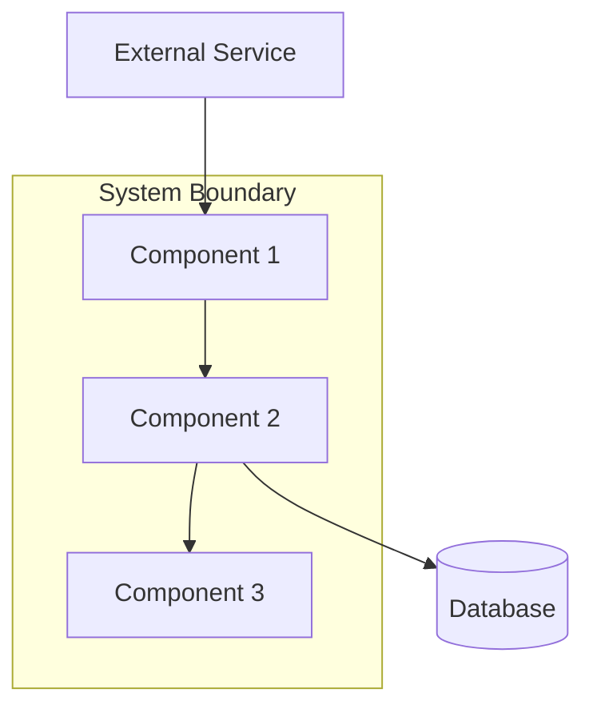
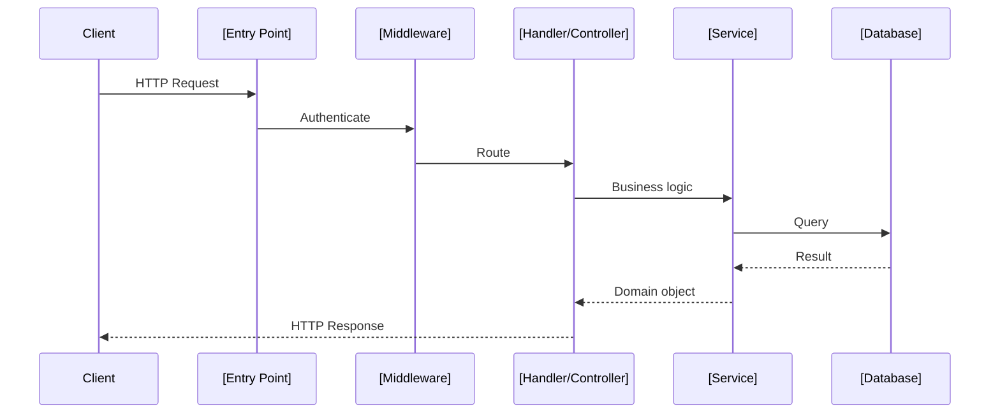
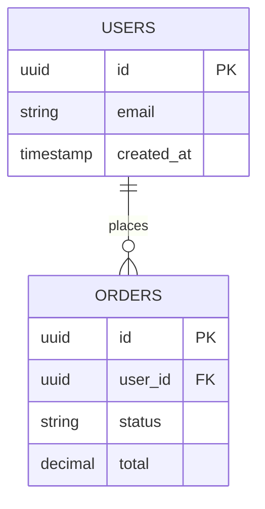

# Design Document Template

Use this template for technical design documents generated by the `reverse-engineer` skill. Sections marked **[Required]** must be present to pass `validate_design_doc.py`.

This document describes the **existing system** as it is, not as it should be. Every architectural decision described here is an observed, existing decision — not a proposal.

---

```markdown
# Technical Design Document: [System Name]

**Version**: 1.0 (reverse-engineered)
**Date**: [YYYY-MM-DD]
**Source**: [repository URL or path]
**Related PRD**: [docs/reverse-engineer/prd.md or N/A]
**Status**: Draft — requires human review

---

## System Overview [Required]

### What It Is
[1-2 sentences: what type of system this is and its primary purpose.]

### What It Does
[3-5 bullet points: the core capabilities of the system, based on PRD functional units.]

- [Capability 1]
- [Capability 2]
- [Capability 3]

### Key Technologies
*Only include what is directly observed in code and dependency files.*

| Layer | Technology | Evidence |
|-------|------------|---------|
| Language(s) | [e.g., TypeScript 5.x] | package.json |
| Runtime | [e.g., Node.js 20] | .nvmrc, Dockerfile |
| Web framework | [e.g., Fastify 4] | package.json, src/server.ts |
| Database | [e.g., PostgreSQL 15] | docker-compose.yml, migrations/ |
| Cache | [e.g., Redis 7] | docker-compose.yml, src/cache/ |
| Message queue | [e.g., RabbitMQ] | docker-compose.yml, src/queue/ |
| Authentication | [e.g., JWT + bcrypt] | src/auth/, package.json |
| Deployment | [e.g., Docker + Kubernetes] | Dockerfile, k8s/ |

---

## Architecture [Required]

### High-Level Structure

*Reference C4 diagrams generated by `/c4-architecture`. Include inline if diagrams are embedded here.*

[C4 Context Diagram — system boundary and external actors]

[C4 Container Diagram — major deployable components]

*If `/c4-architecture` was not used, include a basic mermaid diagram:*



### Architectural Style
*Observed, not prescribed. Describe what exists.*

- **Pattern**: [e.g., Layered MVC, Hexagonal/Ports & Adapters, Event-Driven, Microservices]
- **Evidence**: [directory structure, naming conventions, DI configuration]
- **Key characteristics**: [e.g., stateless request handlers, all state in database, async event processing]

### Request Lifecycle
*How a typical request flows through the system.*



---

## Components [Required]

*One subsection per major component. A component is a distinct deployable or logical unit with its own responsibilities and interfaces.*

### Component: [Name]

**Responsibilities**:
- [What this component owns and does — 3-5 bullets]
- [Focus on verbs: manages, validates, transforms, stores, notifies]

**Interfaces**:
- **Inbound**: [What calls into this component — HTTP routes, function signatures, event topics]
- **Outbound**: [What this component calls — other components, databases, external services]

**Dependencies**:
- [Component/service this depends on] — [why / what it uses it for]

**Key files**:
```
[path/to/main-file.ts]    # [brief description of role]
[path/to/handler.ts]      # [brief description of role]
[path/to/model.ts]        # [brief description of role]
```

**Notes**: [Any observed quirks, known limitations, or areas of high complexity]

---

### Component: [Name]

*Repeat for each component.*

---

## Data Model [Required]

### Database Technology
[Database name and version] — observed in [evidence file].

### Schema Overview

*List tables/collections with their purpose. Generate from migration files if present.*

| Table/Collection | Purpose | Key Columns/Fields |
|-----------------|---------|-------------------|
| `users` | [Purpose] | id, email, created_at |
| `orders` | [Purpose] | id, user_id, status, total |
| `[name]` | [Purpose] | [key fields] |

### Key Relationships



### Data Flow
*How data moves through the system: ingress -> transformation -> storage -> egress.*

[Describe the primary data flow path — e.g., "API receives JSON, validates against schema, transforms to domain model, persists to PostgreSQL, publishes event to RabbitMQ."]

---

## API Surface [Required]

*Document the external API contract as observed in route definitions.*

### [API Group: e.g., Users API]

Base path: `/api/v1/users`

| Method | Path | Description | Auth Required | Key Inputs | Key Outputs |
|--------|------|-------------|---------------|------------|-------------|
| GET | `/` | List users | Yes | query: page, limit, filter | Paginated user list |
| POST | `/` | Create user | Yes (admin) | body: email, role | Created user |
| GET | `/:id` | Get user | Yes | path: id | User object |
| PUT | `/:id` | Update user | Yes | path: id, body: fields | Updated user |
| DELETE | `/:id` | Delete user | Yes (admin) | path: id | 204 No Content |

### Authentication
*Observed authentication mechanism.*

- **Mechanism**: [JWT Bearer, API Key, Session Cookie, OAuth2, mTLS]
- **Implementation**: [file path where auth middleware is defined]
- **Protected routes**: [All routes / specific groups]
- **Token claims**: [What fields are in the token, if observable]

### Error Response Format
*Observed error shape.*

```json
{
  "error": {
    "code": "VALIDATION_ERROR",
    "message": "Human-readable description",
    "details": []
  }
}
```

Evidence: `[file path where error format is defined]`

---

## Integration Points [Required]

*External systems, services, and protocols the system integrates with.*

| Integration | Type | Direction | Purpose | Evidence |
|-------------|------|-----------|---------|---------|
| [Service name] | [REST/gRPC/Queue/DB] | Inbound/Outbound/Both | [Why] | [file path] |

### [Integration: Service Name]

- **Protocol**: [HTTP REST / gRPC / AMQP / etc.]
- **Authentication**: [API key in header / mTLS / OAuth / none]
- **Failure handling**: [Retry logic, fallback behavior, circuit breaker]
- **Configuration**: [How endpoint/credentials are configured — env vars, config file]
- **Key files**: `[path/to/client.ts]`

---

## Deployment [Required]

*Document what is directly observable in infrastructure configuration. Omit speculation.*

### Infrastructure
*Observed from Dockerfile, docker-compose, k8s manifests, terraform, etc.*

| Component | Type | Configuration | Evidence |
|-----------|------|---------------|---------|
| Application | [Container/VM/Serverless] | [CPU/memory limits if set] | Dockerfile |
| Database | [Managed/Self-hosted] | [Instance type if set] | docker-compose.yml |
| Cache | [Redis/Memcached] | [Persistence mode if configured] | docker-compose.yml |

### Environments
*Observed from configuration files, environment variable definitions.*

| Environment | Indicators | Notable Differences |
|-------------|------------|---------------------|
| Development | [.env.development, docker-compose.dev.yml] | [Debug logging, seed data] |
| Staging | [.env.staging, staging config] | [Mirrors production, reduced resources] |
| Production | [.env.production, k8s prod namespace] | [Full resources, strict secrets] |

### Configuration Management
- **Mechanism**: [Environment variables, config files, secrets manager, Vault]
- **Required variables**: [List of critical env vars observed in code]
- **Evidence**: `.env.example`, `src/config/`

---

## Cross-Cutting Concerns [Required]

### Logging
- **Format**: [Structured JSON / plain text]
- **Library**: [Winston, Pino, Zap, structlog, zerolog]
- **Log levels**: [DEBUG/INFO/WARN/ERROR — which are used]
- **Correlation**: [Request ID, trace ID propagation]
- **Evidence**: `[path/to/logger.ts]`

### Error Handling
- **Strategy**: [Centralized error handler / per-controller / middleware]
- **Error types**: [Custom error classes observed]
- **User-facing errors**: [How errors are surfaced to API consumers]
- **Evidence**: `[path/to/error-handler.ts]`

### Authentication and Authorization
- **Authentication**: [Described in API Surface section]
- **Authorization**: [RBAC / ABAC / ACL — mechanism and where enforced]
- **Evidence**: `[path/to/auth-middleware.ts]`, `[path/to/permissions.ts]`

### Caching
- **Store**: [Redis / in-process Map / none]
- **What is cached**: [Session data, query results, computed values]
- **Invalidation strategy**: [TTL-based, event-driven, manual]
- **Evidence**: `[path/to/cache.ts]`

### Observability
- **Metrics**: [Prometheus, StatsD, CloudWatch, none]
- **Tracing**: [OpenTelemetry, Jaeger, X-Ray, none]
- **Health checks**: [Endpoint path, what it checks]
- **Evidence**: `[path/to/metrics.ts]`, `[path/to/health.ts]`

---

## Appendix: File Map

*Key files organized by component for quick navigation.*

```
[Component 1 name]:
  [path/to/entry.ts]          # Entry point / route registration
  [path/to/handler.ts]        # Request handlers
  [path/to/service.ts]        # Business logic
  [path/to/model.ts]          # Data model / schema
  [path/to/repository.ts]     # Database access layer
  tests/[path/to/test.ts]     # Test coverage

[Component 2 name]:
  [path/to/...]               # ...

Infrastructure:
  Dockerfile                  # Container definition
  docker-compose.yml          # Local development services
  [k8s/|terraform/|...]       # Production infrastructure

Configuration:
  .env.example                # Environment variable reference
  [path/to/config.ts]         # Application config loading
```

---

## Checklist (Remove Before Finalizing)

- [ ] All required sections present
- [ ] Every component has: responsibilities, interfaces, dependencies, key files
- [ ] Data model has at least one ER diagram or schema table
- [ ] API surface documents auth requirements per route group
- [ ] All mermaid diagrams render without error
- [ ] File paths in the file map point to files that actually exist
- [ ] No credentials, API keys, or internal URLs in the document
- [ ] C4 diagrams referenced or generated inline
- [ ] Deployment section only includes what is directly observable
```
