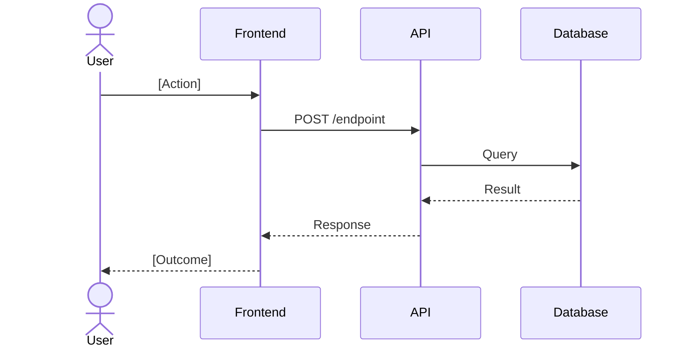
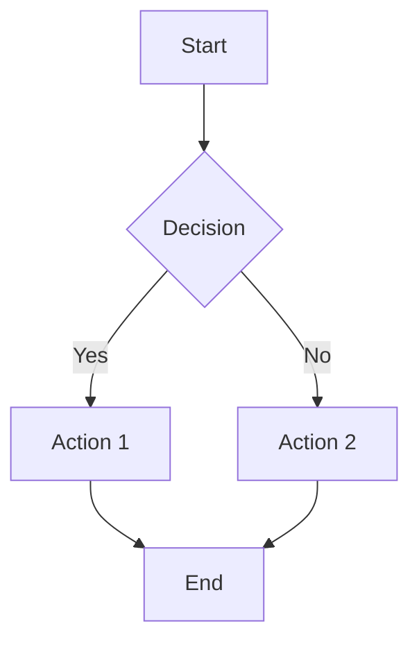

# PRD Template

Use this template for PRDs generated by the `reverse-engineer` skill. Sections marked **[Required]** must be present to pass `validate_prd.py`. Remove instructional text (in italics) before finalizing.

Confidence tags are required on every functional requirement:
- `[Verified]` — code + test, or code + docs
- `[Inferred: <rationale>]` — single source or pattern matching
- Unverified claims belong only in "Undetermined Items"

---

```markdown
# Product Requirements Document: [System Name]

**Version**: 1.0 (reverse-engineered)
**Date**: [YYYY-MM-DD]
**Source**: [repository URL or path]
**Status**: Draft — requires human review

---

## Product Overview [Required]

*2-3 sentences describing what this system does, who it serves, and its primary value proposition. Synthesized from routing analysis, README, and test file descriptions.*

[System Name] is a [type of system] that [primary function]. It serves [primary user types] by [core value delivered]. The system integrates with [key external systems, if any].

---

## User Personas [Required]

*Inferred from entry points, authentication patterns, and UI components. Each persona represents a distinct user type with different access patterns.*

### Persona 1: [Name]
- **Description**: [Who they are]
- **Primary actions**: [What they do in the system]
- **Entry points**: [How they access the system — web UI, API, CLI, etc.]
- **Evidence**: [file paths where this persona's access patterns are visible]
- **Confidence**: [Verified | Inferred: rationale]

### Persona 2: [Name]
*Repeat for each identified persona.*

---

## Functional Requirements [Required]

*Grouped by functional unit from the scope report. Each requirement has an ID, user story, confidence tag, and evidence.*

*Requirement ID format: REQ-XXX where XXX is a zero-padded sequential number.*

### [Functional Unit 1 Name]

*Brief description of this unit's purpose.*

#### REQ-001: [Short requirement title]

**User story**: As a [persona], I can [action] so that [value].

**Description**: [1-2 sentences describing the behavior in detail.]

**Confidence**: [Verified] | [Inferred: single implementation in X, no test coverage]

**Evidence**:
- `src/path/to/implementation.ts` — core logic
- `tests/path/to/test.ts` — behavioral confirmation (if Verified)

---

#### REQ-002: [Short requirement title]

**User story**: As a [persona], I can [action] so that [value].

**Description**: [1-2 sentences.]

**Confidence**: [Verified]

**Evidence**:
- `src/path/to/file.ts:23-45`

---

*Continue REQ-00N for all requirements in this unit.*

### [Functional Unit 2 Name]

*Repeat requirement structure for each unit.*

---

## Non-Functional Requirements [Required]

*Only include what is directly observable in code or configuration. Do not speculate.*

### Performance
- [NFR-P1]: [Observable performance characteristic — e.g., "Database queries use connection pooling" [Verified: src/db/pool.ts]]
- [NFR-P2]: [Caching behavior if observed]

### Security
- [NFR-S1]: [Authentication mechanism — e.g., "All API endpoints require JWT bearer token" [Verified: src/middleware/auth.ts]]
- [NFR-S2]: [Input validation approach]
- [NFR-S3]: [Secret management approach — env vars, vault, etc.]

### Reliability
- [NFR-R1]: [Error handling approach — e.g., "Structured error responses with error codes" [Inferred: pattern observed in 3 controllers, no explicit policy doc found]]
- [NFR-R2]: [Retry logic, circuit breakers if present]

### Scalability
- [NFR-SC1]: [Horizontal scaling indicators — e.g., stateless services, external session store]
- [NFR-SC2]: [Database read replicas, sharding if configured]

### Observability
- [NFR-O1]: [Logging approach — structured vs unstructured, log level configuration]
- [NFR-O2]: [Metrics and tracing — OpenTelemetry, Prometheus, etc.]

---

## Scope Boundary [Required]

### In Scope
*What this system demonstrably does, based on code analysis.*

- [Feature/capability 1]
- [Feature/capability 2]
- ...

### Out of Scope
*What this system explicitly does NOT do, based on absence of code or explicit guards.*

- [Non-feature 1 — e.g., "Does not send SMS notifications (no SMS provider SDK found)"]
- [Non-feature 2]
- ...

### Assumed Out of Scope (No Evidence Found)
*Capabilities that might be expected but show no code evidence.*

- [Capability with no trace]

---

## User Journey Diagrams

*Key workflows visualized. Generate one diagram per major user journey. Use mermaid sequence or flowchart.*

### Journey 1: [Primary workflow name]



### Journey 2: [Secondary workflow name]



---

## Undetermined Items [Required]

*Questions requiring human input. Maximum 5 high-priority items. Strictly no speculation — only document what was specifically observed as ambiguous or missing.*

*If no undetermined items exist, write: "None — all observed behaviors were classifiable with available evidence."*

1. **[Topic]**: [Specific question]. Observed indicator: [what was seen in code that raised this question]. Location: `src/path/to/relevant/file.ts`.

2. **[Topic]**: [Specific question]. Observed indicator: [what triggered this]. Location: `src/path/to/file.ts`.

*Examples of good Undetermined Items:*
- *"A TODO comment at src/billing/invoice.ts:45 references 'PDF export'. No implementation found. Is this planned, removed, or out of scope?"*
- *"The user model has an `is_enterprise` boolean field but no code paths branch on it. Is enterprise functionality implemented elsewhere or not yet built?"*

---

## Appendix: Discovery Evidence

*Map of functional units to the discovery sources that identified them. Supports auditability of the reverse-engineering process.*

| Functional Unit | Primary Source | Supporting Sources | File Count |
|-----------------|---------------|-------------------|------------|
| [Unit 1] | Routes (Priority 1) | Tests (Priority 2), Module structure (Priority 4) | [N] files |
| [Unit 2] | Test files (Priority 2) | Directory structure (Priority 7) | [N] files |

### Confidence Distribution Summary

| Level | Count | Percentage |
|-------|-------|------------|
| Verified | [N] | [X]% |
| Inferred | [N] | [Y]% |
| (Unverified in Undetermined Items) | [N] | — |
| **Total core requirements** | [N] | 100% |

Quality gate: Verified must be >= 80% of core requirements.
Status: [PASS | FAIL — [N] additional requirements need verification]

### Key Files by Functional Unit

```
[Unit 1 name]:
  - src/path/to/main-file.ts    # [brief description]
  - src/path/to/handler.ts      # [brief description]
  - tests/path/to/test.ts       # [brief description]

[Unit 2 name]:
  - src/path/to/service.ts      # [brief description]
```
```

---

## Checklist (Remove Before Finalizing)

- [ ] All required sections present
- [ ] Every functional requirement has a confidence tag
- [ ] Every Verified requirement has at least 2 evidence sources
- [ ] Every Inferred requirement has a rationale in the tag
- [ ] No Unverified claims in the main requirements body
- [ ] Verified requirements are >= 80% of total core requirements
- [ ] Requirement IDs are sequential (REQ-001, REQ-002, ...)
- [ ] All mermaid diagrams have been tested (render without error)
- [ ] Undetermined Items are specific questions, not vague statements
- [ ] No placeholder text remains (`[TODO]`, `[PLACEHOLDER]`, `[TBD]`)
- [ ] No credentials, API keys, or internal URLs in the document
