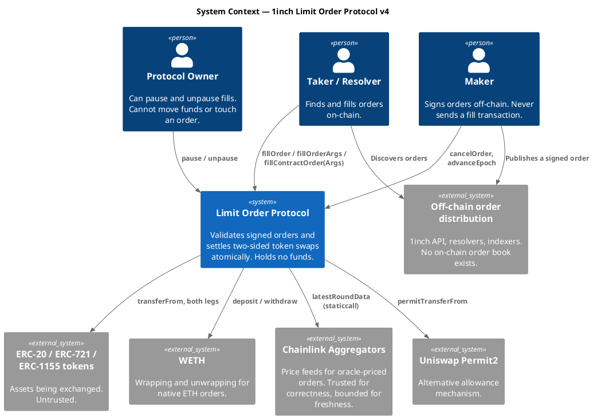
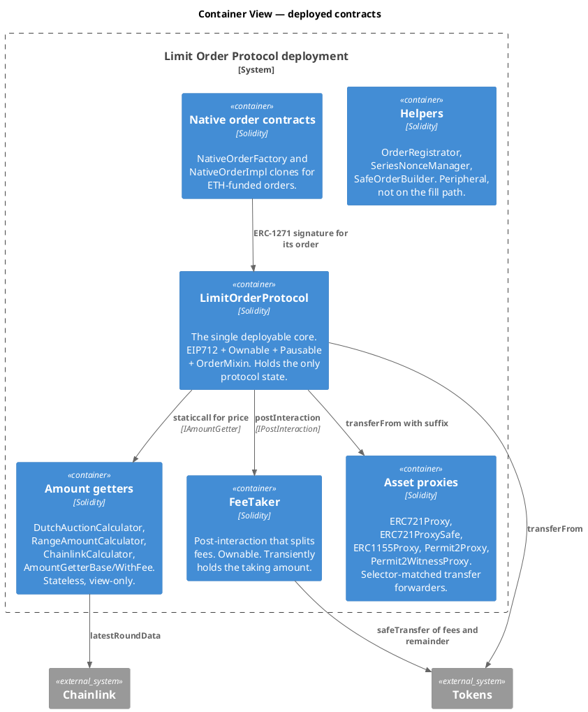
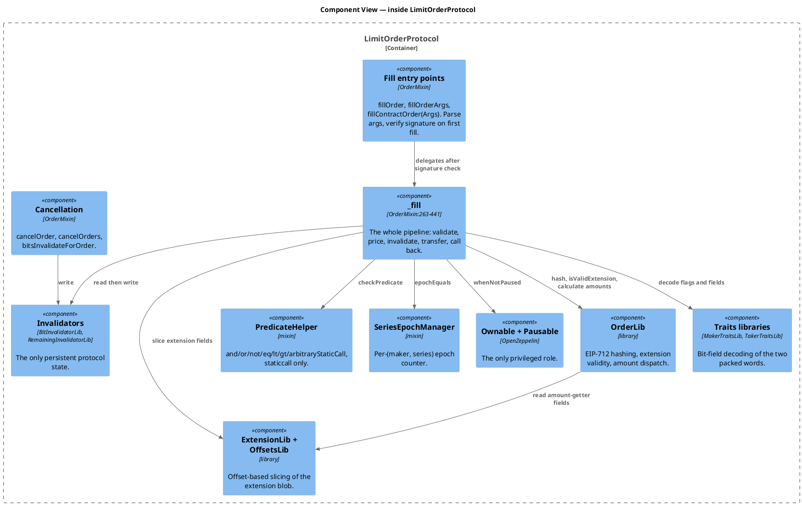
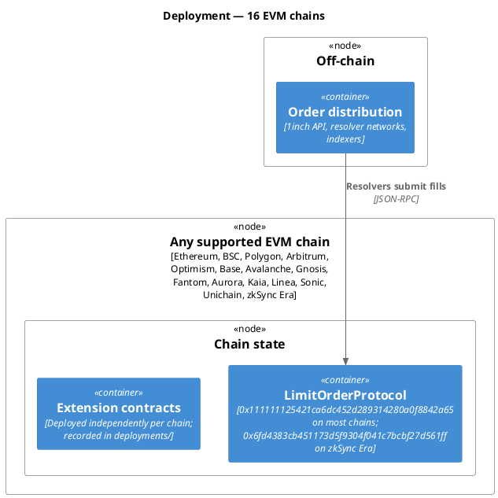

# arc42 architecture documentation — 1inch Limit Order Protocol v4

Phase 3A, optional, requested via `--with-optional`. Produced with the `arc42-c4`
specialist.

**This document does not replace the protocol-specific architecture.** Per the
orchestrator's Phase 3A rule, C4 is applied selectively and the asset, math,
state, privilege and invariant models stay where they are. Sections below link
out rather than restate:

| For | Read |
|---|---|
| Trust model, actors, privilege map | [`01-trust-and-actors.md`](01-trust-and-actors.md) |
| Storage, inheritance, delegatecall | [`02-contracts-and-storage.md`](02-contracts-and-storage.md) |
| Flows and state machines | [`03-flows-and-state-machines.md`](03-flows-and-state-machines.md) |
| Assets, formulas, rounding, assumptions | [`04-assets-math-and-assumptions.md`](04-assets-math-and-assumptions.md) |
| Invariants | [`../07-test-strategy.md`](../07-test-strategy.md) |

Baseline `837c8f82`.

---

## 1. Introduction and goals

An on-chain settlement engine for limit orders created off-chain. Its stated
goals, from `README.md` and `description.md`, are extreme flexibility and high
gas efficiency.

| Quality goal | How the architecture serves it |
|---|---|
| Flexibility | Behaviour beyond the fixed 8-field order lives in extensions: arbitrary predicates, pricing getters and callbacks, bound to the order by hash |
| Gas efficiency | Bit-packed traits in two `uint256` words; offset-packed extension calldata; two invalidator strategies chosen per order; `viaIR` with 1,000,000 optimizer runs |
| Non-custodial | The protocol never holds funds, so there is nothing to lose |
| Immutability | No proxy, no admin over orders, no upgrade path |

Top three requirements by criticality: `ACC-001` (only the maker's signature
authorises a fill), `STATE-002`/`STATE-003` (an order cannot be over-filled),
`SEC-001` (simulation cannot persist state).

## 2. Architecture constraints

| Constraint | Source | Consequence |
|---|---|---|
| EVM, Solidity 0.8.30 | Deployment target | 24 KB contract limit; `LimitOrderProtocol` deploys at 5,286,226 gas, 17.6% of the block limit |
| EIP-712 signing | Interoperability with wallets | Order identity is a typed-data hash bound to chain and address |
| Orders are 8 fixed 32-byte fields | Gas and calldata cost | Everything dynamic must go in the extension, hashed into the salt |
| No upgradeability | Deliberate | A defect can only be mitigated by pause or cancellation, never patched |
| Same address across chains | Operational | Deterministic deployment; zkSync Era differs by necessity |
| Hardhat 2, JavaScript, CommonJS | Existing repository | Preserved throughout this workflow; no migration |

## 3. System scope and context

### C4 Level 1 — System context

The context diagram makes the defining property visible: the maker never sends a
transaction to the protocol in the normal flow, and the order itself arrives from
outside the system entirely.

## 4. Solution strategy

| Problem | Approach |
|---|---|
| Order storage cost | Do not store orders. Keep only a consumption record keyed by maker |
| Cancellation cost | Two strategies: a 256-orders-per-slot bitmap for single-fill orders, a per-order remainder for partially fillable ones |
| Mass cancellation | A per-`(maker, series)` epoch counter; one write invalidates arbitrarily many orders |
| Distinguishing "unseen" from "exhausted" without a flag | Store the bitwise complement of the remaining amount |
| Extensibility without changing the order struct | Extension blob committed to by the low 160 bits of the salt |
| Untrusted extension code | Write the invalidator before invoking any callback; restrict predicates to `staticcall` |
| Non-ERC20 assets | Proxy contracts whose function selector is ground to match `transferFrom` |

## 5. Building block view

### C4 Level 2 — Containers

Only `LimitOrderProtocol` holds protocol state. Everything else is stateless, or
holds its own unrelated state, and is reached by address from an extension blob.
There is no registry: any address can be named as an extension.

### C4 Level 3 — Components inside the core

## 6. Runtime view

The seven-step fill sequence, the ETH path, cancellation, epoch invalidation,
pause and simulation are documented as `FLOW-001` through `FLOW-010` in
[`03-flows-and-state-machines.md`](03-flows-and-state-machines.md), with the
order lifecycle as `SM-001` through `SM-007`. Not duplicated here.

The one runtime detail worth repeating at architecture level, because it explains
the security posture: **the invalidator is written before any callback runs.**
Every reentrancy protection in the design follows from that ordering, and the one
place it does not hold — the maker permit, which executes earlier — is exactly
where an explicit reentrancy check was added.

## 7. Deployment view

One instance per chain, constructor-bound to that chain's WETH. Domain separation
by chain ID and contract address means a signature is valid on exactly one
deployment. `deployments/` records 104 deployment artefacts across 16 chains;
mainnet has the most at 10.

## 8. Cross-cutting concepts

| Concept | Realisation |
|---|---|
| Authorisation | EIP-712 or ERC-1271 on first fill only; thereafter the invalidator record is the authority |
| Bit packing | Two `uint256` traits words; 13 maker fields, 8 taker fields; see `01-core-protocol.md` |
| Rounding policy | Making floors, taking ceils; every rounding favours the maker, including the fee overlay |
| Error handling | 19 custom errors on `IOrderMixin` plus per-contract errors; `OrderLib` returns a selector which `_fill` re-throws by raw assembly revert |
| Reentrancy | Effects-before-interactions on the invalidator, plus one explicit guard on the permit path |
| Extensibility | Address-in-calldata dispatch with no registry and no allowlist |
| Events | Deliberately minimal: `OrderFilled`, `OrderCancelled`, `BitInvalidatorUpdated`. Off-chain indexers reconstruct the rest |
| Gas | `viaIR`, 1,000,000 optimizer runs, `unchecked` where provably safe, reported per test but never asserted |

## 9. Architecture decisions

No ADR directory exists in this repository. The decisions below were recovered
from code and documentation during Phases 1-3; **none is a historical record and
no rationale here is quoted from a decision-maker.** Phase 10 would create real
ADRs only for new decisions made during this workflow, and none has been.

| # | Decision | Evidence |
|---|---|---|
| D1 | No on-chain order book; orders live entirely off-chain | Absence of order storage; `OrderRegistrator` emits without storing |
| D2 | Two invalidator strategies rather than one | `MakerTraitsLib.useBitInvalidator` and both mappings |
| D3 | Bind extensions by 160-bit hash truncation rather than full hash | `OrderLib:179`; the salt's high 96 bits are the maker's |
| D4 | Immutability over upgradeability | No proxy anywhere |
| D5 | Pause as the only privileged capability | `LimitOrderProtocol:49-58`, and nothing else `onlyOwner` |
| D6 | Cancellation deliberately not pausable | `whenNotPaused` on `_fill` alone |
| D7 | Predicates restricted to `staticcall` | `PredicateHelper:81`, documented at `description.md:511` |
| D8 | Fees implemented as an extension, not in the core | `FeeTaker` is a plain `IPostInteraction` |

## 10. Quality requirements

| Attribute | Target | Current measurement |
|---|---|---|
| Correctness | No over-fill, no unauthorised fill | 173 tests pass; 91.88% statements, **75.44% branches** |
| Gas | Minimal per fill | `fillOrder` averages 100,323; `fillOrderArgs` 123,888 |
| Deployability | Under the contract size limit | 17.6% of the block gas limit |
| Availability | Fills always possible unless paused | Single owner can pause; no timelock |
| Auditability | Immutable, small state surface | Two mappings; last audited tag is 4.3.2, current version 4.3.4 |

## 11. Risks and technical debt

Observations from Phases 0-6A. Not severities — Phase 11 owns those.

| # | Item | Evidence |
|---|---|---|
| R1 | Deployed code is past its last audit | Version 4.3.4, last audited tag 4.3.2; `README.md` warns master is unaudited |
| R2 | The specification misdescribes the integration surface | `DIV-001`, `DIV-002`, `DIV-003`, `DIV-014` |
| R3 | `FeeTaker` is deployed on 14 chains with no specification | `DIV-010`, `OQ-3` |
| R4 | Branch coverage is 16 points below statement coverage | Phase 6A |
| R5 | Three test files assert nothing at all | `GAP-Q01` |
| R6 | A 283-line example suite has been permanently disabled | `GAP-Q02` |
| R7 | Two production contracts have zero coverage | `ERC1155Proxy`, `ERC721ProxySafe` |
| R8 | No property, invariant or fork testing exists, and no tool is installed | Phase 6 |
| R9 | Three independent `Ownable` instances, holders unverified | Phase 4, `OQ-4` |
| R10 | Generated docs are stale: a page for a deleted contract, six contracts with no page | Phase 0 |
| R11 | Local (`--parallel`) and CI (serial) test commands differ | `GAP-Q05` |

## 12. Glossary

| Term | Meaning |
|---|---|
| Maker | Signs an order off-chain; supplies the maker asset |
| Taker / Resolver | Submits the fill transaction; supplies the taker asset |
| Making amount | Quantity of the maker's asset moving to the taker |
| Taking amount | Quantity of the taker's asset moving to the receiver |
| Maker traits | A packed `uint256` of the maker's flags, expiry, series, nonce and allowed sender |
| Taker traits | A packed `uint256` of the taker's flags, threshold and args lengths |
| Extension | Optional calldata blob of up to 9 offset-packed fields, bound by the salt |
| Predicate | A `staticcall`-only condition that must return exactly 1 |
| Amount getter | A contract that prices the fill instead of the linear default |
| Bit invalidator | Bitmap consumption record for single-fill orders |
| Remaining invalidator | Per-order remainder, stored as its bitwise complement |
| Epoch | Per-`(maker, series)` counter enabling mass cancellation |
| Series | Identifies the application that issued a group of orders |
| Interaction | A callback into maker- or taker-nominated code during a fill |
| Threshold | The taker's slippage bound; zero disables it entirely |
