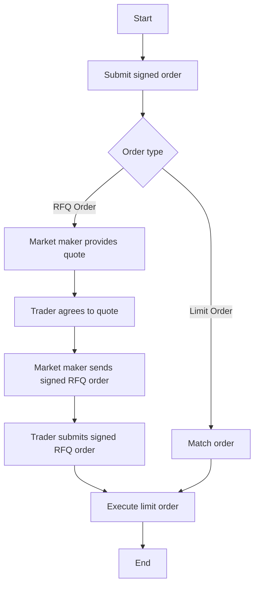

# This Markdown document contains a detailed overview of the differences between Limit Orders and RFQ Limits.

The main difference between a regular **Limit Order** and an **RFQ** (Request for Quotation) **Order** is in how the orders are filled and the level of flexibility they offer.

A **Limit Order** is a type of order where a trader specifies the price and quantity of an asset they want to buy or sell, and the order is placed on an order book. The order remains on the order book until it is either filled or canceled. When a matching order is found on the other side of the order book, the trade is executed at the specified price.

An **RFQ order**, on the other hand, is a request for a quote from a market maker, where the trader specifies the asset they want to buy or sell and the quantity they are interested in. The market maker then provides a quote for the requested trade, including the price at which they are willing to buy or sell the asset. The trader can then decide whether to accept the quote or not.

The key difference between the two order types is that a limit order is placed on an order book and executed automatically when a matching order is found, while an RFQ order requires a quote from a market maker before it can be executed. RFQ orders are typically used by market makers to provide liquidity and by traders looking to execute large trades with minimal slippage.

Additionally, the 1inch limit order protocol offers some additional features such as partial fills, expiration times, and custom predicates for limit orders, while RFQ orders are optimized for gas efficiency and have restricted capabilities suitable for market makers.

# A Tabular Representation Of Their Differences

|  | Limit Orders | RFQ Orders |
|---|---|---|
| Order type | Placed on an order book | Request for a quote from the market maker |
| Execution | Request for a quote from the market maker | Manual after quote acceptance |
| Level of flexibility | High | Low |
| Purpose | Retail trading | Liquidity provision |
| Slippage | Possible | Minimal |
| Features | Partial fills, custom predicates, expiration times | Gas efficiency, single-use, expiration times, limited functionality |
| Usage | Common in retail trading | Common in market making |

# Flowchart 

