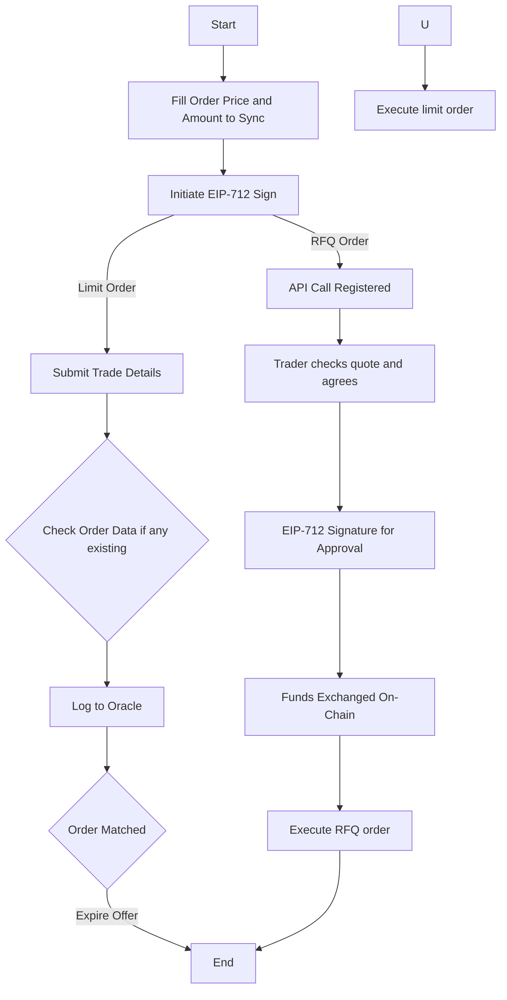

### Limit Orders

A Limit Order is an order to buy or sell a specific amount of a cryptocurrency at a predetermined price or better. When you place a Limit Order, you set the maximum or minimum price at which you're willing to buy or sell the cryptocurrency. Once the market price reaches your desired price, the Limit Order is executed automatically.

In 1inch, you can use Limit Orders to trade cryptocurrencies with minimal slippage. Since the Limit Order specifies the price at which you want to buy or sell, you can be sure that you'll get the price you want.

### RFQs

An RFQ is a way to request a quote for a specific trade from a liquidity provider. When you submit an RFQ, you provide the details of the trade you want to make, such as the amount of cryptocurrency you want to buy or sell and the currency pair you're interested in.

Liquidity providers can then respond to your RFQ with a quote for the trade. If you accept the quote, the trade is executed.

RFQs are useful in situations where you want to trade a large amount of cryptocurrency and want to get a good price. By requesting quotes from multiple liquidity providers, you can compare prices and choose the best one. RFQs can also be useful if you want to trade a cryptocurrency that doesn't have a lot of liquidity on traditional exchanges.

### Difference between Limit Orders and RFQs

The main difference between limit orders and RFQs is that:

 - A  limit order allows the trader to specify the price at which they want to buy or sell a cryptocurrency.
 - An an RFQ allows the trader to request a quote from liquidity providers before placing a trade. (manual intervention required)
 - With a limit order, the trade will be executed automatically once the price reaches the specified price or lower.
 - . With an RFQ, the trader has the option to accept or reject the quote from the liquidity provider before the trade is executed.

Both Orders are executed using the: [EIP-712 Protocol](https://eips.ethereum.org/EIPS/eip-712)

### Comparison of Features in a Tabular Format
| Feature List | Limit Order | RFQ |
|--|:-:|:-:|
| Partial Fill | ✅ | ✅ (only once)
| Predicates | ✅ | ✅ 
| Single cancellation | ✅ | ✅ 
| Cancellation by Order ID | ⛔ | ✅ 
| Accessible | ✅ | ✅ (API)
| Bunch cancellation | ✅ | ⛔
| Fullness check | ✅ | ✅ 
| Validation | ✅ | ✅ 

  ### Flowchart of Process
    

