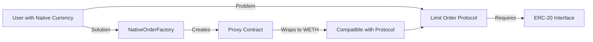
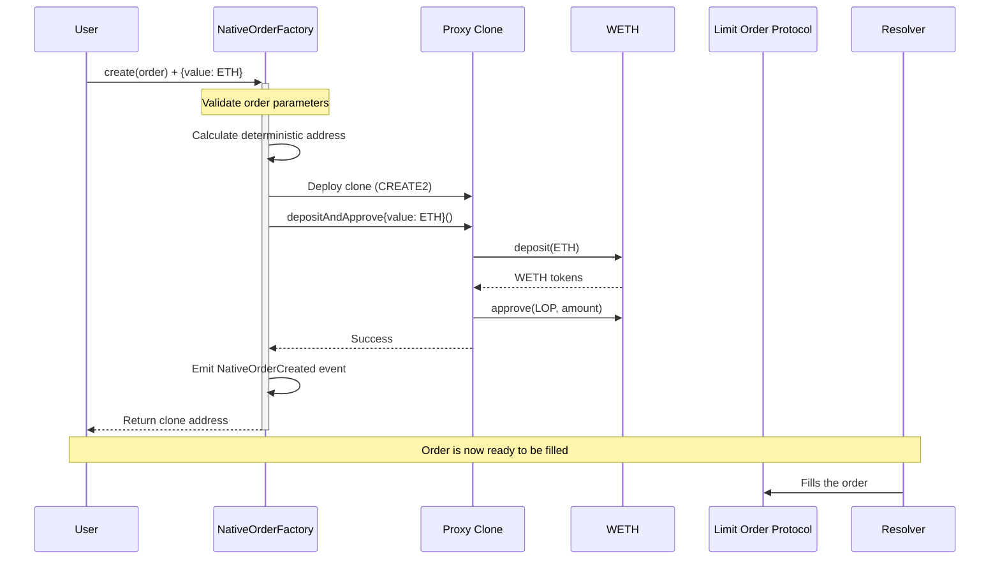
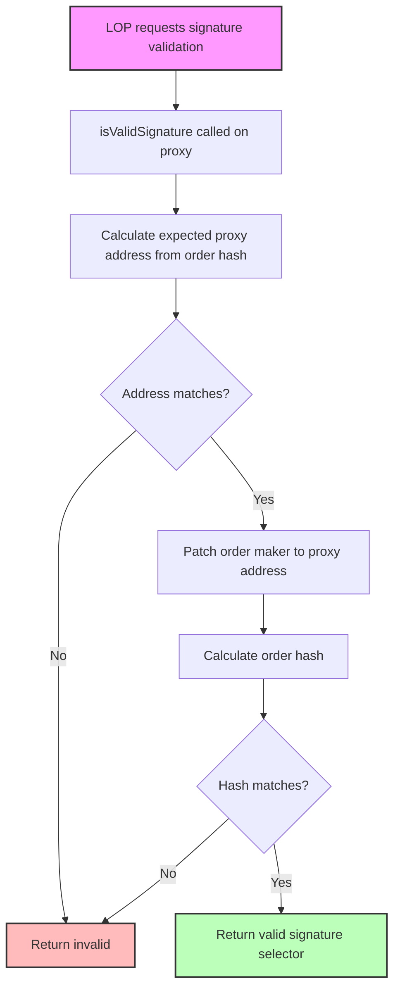
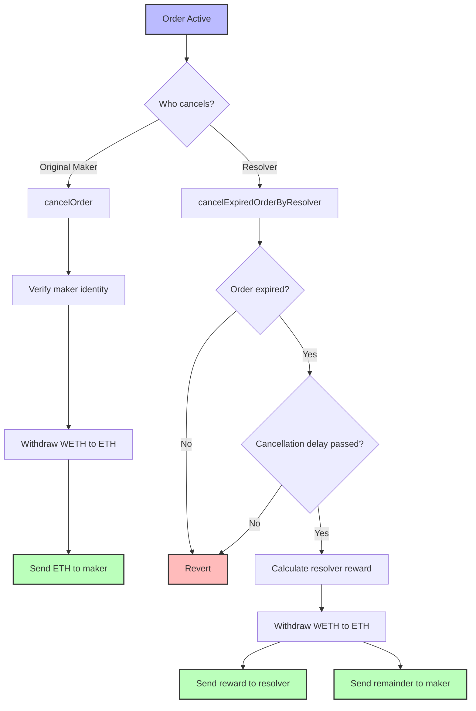

# Native Currency Support in 1inch Limit Order Protocol

## Overview

The 1inch Limit Order Protocol works with ERC-20 tokens, but doesn't handle native blockchain currency (ETH, BNB, MATIC, etc.). Native currencies cannot directly approve spending allowances or be transferred using standard ERC-20 interfaces. The `NativeOrderFactory` extension solve this problem by creating a proxy system that wraps native currency into WETH (Wrapped ETH) while maintaining full compatibility with the existing limit order infrastructure.

## Architecture

The native order extension consists of two main contracts working in tandem:

1. **NativeOrderFactory**: The factory contract that deploys deterministic proxy clones
2. **NativeOrderImpl**: The implementation contract that handles WETH conversion and order management

## Order Creation Flow

When a user wants to create a limit order with native currency, the following sequence occurs:

### Key Steps Explained:

1. **Order Validation**: The factory validates that:
   - The maker is the message sender
   - A valid receiver is specified
   - The native currency value matches the order's making amount

2. **Deterministic Clone Creation**: Uses CREATE2 with the order hash as salt, ensuring:
   - The same order always produces the same proxy address
   - Address can be predicted before deployment
   - Prevents duplicate orders

3. **WETH Conversion**: The proxy immediately:
   - Wraps the received native currency (e.g. ETH) into wrapped tokens (e.g. WETH)
   - Approves the Limit Order Protocol to spend the wrapped tokens

## Signature Validation (ERC-1271)

The proxy implements ERC-1271 to validate signatures without requiring private keys:

This mechanism allows the proxy to "sign" orders without having a private key, using deterministic addressing as proof of validity.

## Cancellation Mechanisms

Native order can be cancelled either by Maker itself or by a Resolver. Cancellation by Resolver requires small part of native currency to compensate for gas costs and incentivize the cancellation.

##### User Cancellation
- Only the original order maker can cancel their own order
- Returns the full remaining wrapped token balance as native currency
- No time restrictions

##### Resolver Cancellation
- Requires holding the access token for the Resolver
- Only works on expired orders
- Provides gas compensation to the resolver (capped at `basefee * 30,000 * 1.1`)

### Fund Recovery
The `rescueFunds` function allows recovery of accidentally sent tokens while protecting active order funds:
- For wrapped tokens: Only allows withdrawal of excess funds beyond the active order amount
- For other tokens: Direct transfer to specified recipient
- Restricted to resolver role for additional security